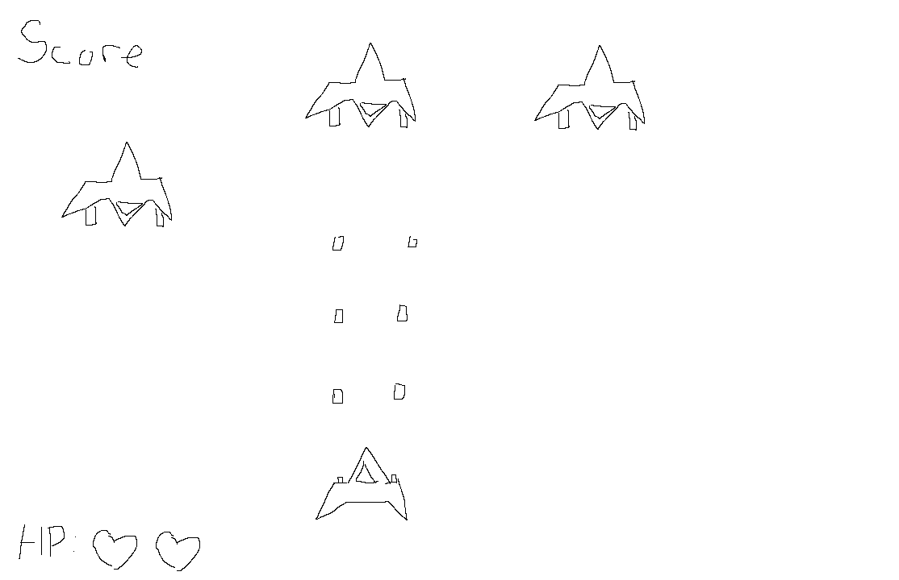
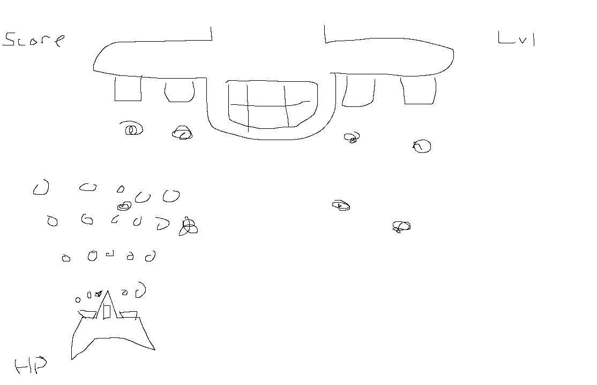

# Karl Sun
## Game Title
SpaceCraft

## High Concepting 
Taking place in deep space, a spacecraft is sent out on a rescue mission to the world TXII-9 until it meets aggressive forces that try to take it down. Through dodging and destroying enemy aircrafts to gain upgrades, the spacecraft must survive the attack and complete its mission.

## Genre
Shooter, Action, Arcade, Avoidance

## Platform
Desktop only

## Story
IV.	A rescue mission to a distant planet turns into an attack and avoid battle as the player must destroy enemy fleet to push forward.

## Esthetics
### Graphics style:
Cartoon
### Sound:
Spacecraft shooting sounds with a arcade-type background music(like pacman)
### Scoring:
Levels will be based on what enemy wave it is on
### HP and Score Streaks:
Based on players kill streak before a ship gets past

## Gameplay
### Mechanics:
Ships shooting pattern changes and gets stronger with each level increase
### Controls
Arrow keys on the keyboard to move, ship is constantly shooting by default
### Teaching the game
In-game instructions that pop up
### Player learning
Player needs to learn how to react faster as levels increases and to prioritize which ship to destroy first

## Sketches
(im bad at drawing on MS Paint)
Sketch 1

Sketch 2(Boss fight)

